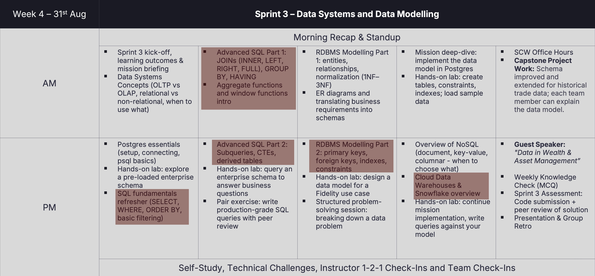

# Chennai playlist

## Today's Menu (Tuesday)
- We are doing good! Good job and THANK YOU to everyone!
- From feedbacks we will ask you to do some little adjustements for those who are not doing the following:
  - Some rooms have been reading too much the slides. Don't, try to make it interactive, asking them questions etc.
  - Dont stay static! Once you run a lab, go from a table to another one, to a trainee to another one and try to have interaction with everyone asking if all is good, if there are any questions etc.

- Get the temperature at the begining of all days. Do they know the topic etc?
- Anything related to AI, just skip or find an alternative, slides are designed for all location but until now they are not allowed to use AI.

In red, what is cancelled. it do not represent the real schedule. use the tracking one to see modules that you are teaching.

### Planning
 - 9 to 9:05. lets have a daily standup. 
 - Talk about the progran of the day, interact with them!
 - Then program continuation.
 - Any time during the day, you can have a small activity if they are sleepy. Some are collected here: [here](http://slides.tomdev.it) - Activities tab
 - Before morning break. [Easy Retro](https://neueda-training.atlassian.net/wiki/spaces/neuedainst/pages/920485891/Chennai+India) 
   - Keep in mind that easy retros are here to improve our delivery, not to judge anyone. Narrative with students is to ask them to write anything that can be improved but also anything they enjoy!
 
 
 - #### /!\ PLEASE TRACK YOUR PROGRESS [HERE](https://docs.proton.me/sheet?mode=open-url&token=FJBAMEYS4G&linkId=UZ-RuDTzzXJIdtGqhjykYShcbj_AliQs9CjUjDtQg9B3DIarDUP1CfG-5joGHt4xOBU_qt0Tc3mQTmbcdhBVTA%3D%3D#3QSZdtqKLPr2)

- #### Detailed schedule.
  - Please take this with caution, it really depends on trainees and teaching style it have been generated so please keep it as a hint more than a real thing: [schedule](./resources/planned-time.md)

## Links & resources
 - [Tracking your progress](https://docs.proton.me/sheet?mode=open-url&token=FJBAMEYS4G&linkId=UZ-RuDTzzXJIdtGqhjykYShcbj_AliQs9CjUjDtQg9B3DIarDUP1CfG-5joGHt4xOBU_qt0Tc3mQTmbcdhBVTA%3D%3D#3QSZdtqKLPr2): Before each session and once its done, update the tracking here and check others instructor progress.
 
 - [wheelofnames](https://wheelofnames.com/). Idealy we will run this a few time per week mostly to make them engaged and less sleepy. Small reward for each participants (candy, chocolate, whatever) Here are some [questions you can run](https://slides.tomdev.it/). I will update the quizz very soon but for now, you have an idea of the type of questions. Happy to get any suggestions! 

 - [Neueda quizz platform](https://quiztime.neueda.com/dashboard): There is a Chennai folder here with quizzes we will run probably once a week on the day before capstone project. For now the quizzes are the one from another session. Dont bother with content for now, I will update it according to our needs.

- [instructor guide](https://neueda.sharepoint.com/:w:/r/sites/CourseMaterials/_layouts/15/Doc.aspx?sourcedoc=%7B4D0A26DC-1892-4F2B-8DDC-2307D9D0106D%7D&file=Sprint3-Instructor-Guide.docx&action=default&mobileredirect=true)

## Easy Retro boards
Run before the morning break. Each room has its own board — project the QR code (or print it) so trainees can scan it straight from their phone.

Reminder for the narrative: retros improve **our delivery**, they are not there to judge anyone. Ask them to write what could be better *and* what they enjoyed.

| Room | QR code | Board link |
| --- | --- | --- |
| **SE1** | [qr-se1.png](./resources/easyretro-qr/qr-se1.png) | [Open board](https://easyretro.io/publicboard/NTDqkkm6utgJFD9cdBrdb4sI6n72/bbbf2a28-d714-42c7-893f-20a3410d5dc2) |
| **SE2** | [qr-se2.png](./resources/easyretro-qr/qr-se2.png) | [Open board](https://easyretro.io/publicboard/NTDqkkm6utgJFD9cdBrdb4sI6n72/67a704f6-77a7-40ed-b597-755cabbd16a9) |
| **SE3** | [qr-se3.png](./resources/easyretro-qr/qr-se3.png) | [Open board](https://easyretro.io/publicboard/NTDqkkm6utgJFD9cdBrdb4sI6n72/c82823ee-6601-48f2-9d7d-10da3b5d19f6) |
| **SE4** | [qr-se4.png](./resources/easyretro-qr/qr-se4.png) | [Open board](https://easyretro.io/publicboard/NTDqkkm6utgJFD9cdBrdb4sI6n72/9a174e04-bbba-4fa2-8685-d07347e14b8c) |
| **SE5** | [qr-se5.png](./resources/easyretro-qr/qr-se5.png) | [Open board](https://easyretro.io/publicboard/NTDqkkm6utgJFD9cdBrdb4sI6n72/fe76a897-5630-4c6a-a8a2-8352ecc2240b) |
| **SE6** | [qr-se6.png](./resources/easyretro-qr/qr-se6.png) | [Open board](https://easyretro.io/publicboard/NTDqkkm6utgJFD9cdBrdb4sI6n72/d9b9b448-ef1f-48f2-8d50-fed9c6635d88) |

## Labs
- https://github.com/Neueda-Technologies/leap-sprint3

## Breaks 
### Lunch
12h15 - 13h15

### Tea time
Please put an alarm.
#### Morning :-
- SE1, SE2, SE3 - 10.30 - 10.45
- SE4, SE5, SE6 - 10.50 - 11.05

#### Afternoon :-
- SE1, SE2, SE3 - 15.00 - 15.15
- SE4, SE5, SE6 - 15.20 - 15.35
